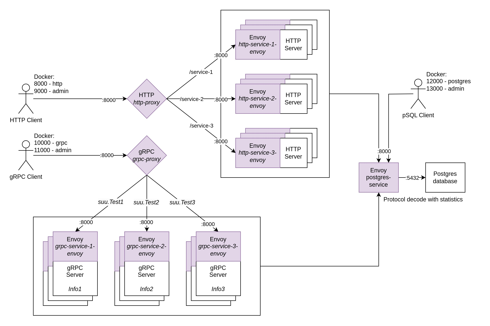

# Envoy

Authors: Filip Kitka, Mateusz Furga, Norbert Morawski, Łukasz Wala

Group: 6 (Thursday 13:15) | Year: 2024

## Case study

[Case study PDF](docs/doc.pdf)

## Service mesh setup
In main repo dir run:
	- Build & deploy: `docker compose up --build -d`,
	- Verify: `./test.sh`.

Scaling test:
	- `docker compose scale http-service-1-envoy=3`,
	- `docker compose scale grpc-service-1-envoy=3`,
	- observe **IP** address change during multiple `./test.sh` runs.
